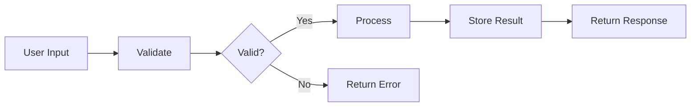
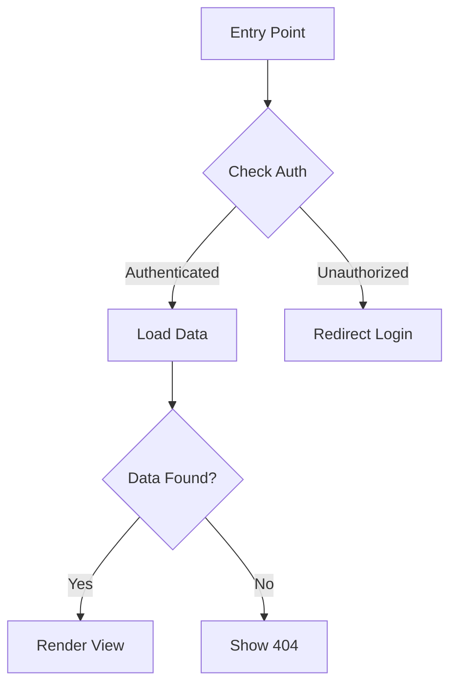

# Code Explainer

Deliver structured, multi-level explanations of code files that progressively deepen understanding from beginner to legendary-level insights.

## Workflow

When asked to explain a file or code:

1. **Read the target file** completely
2. **Analyze** its structure, purpose, dependencies, and key components
3. **Identify critical sections**: complex algorithms, design patterns, architectural decisions
4. **Generate the explanation** following the output structure below

## Output Structure

Use this template for every explanation:

```markdown
# [File Name] - Code Explanation

## Overview
[1-2 sentence summary of the file's purpose and role in the project]

**Language**: [language]  
**Key Responsibilities**: [bullet list of 2-4 main responsibilities]  
**Dependencies**: [notable imports/dependencies]

---

## Architecture & Flow

### Data Flow
[Mermaid diagram showing how data moves through the file]

### Control Flow
[Mermaid diagram showing execution paths and decision points]

### Component Relationships
[Mermaid diagram showing how this file's components relate to each other and external modules]

---

## Critical Code Sections
[Extract and annotate the 3-5 most important code blocks with explanations of WHY they matter]

---

## Level 1: Basic
[Fundamental concepts and overall purpose - aimed at someone new to programming or the codebase]

### What This File Does
### Key Concepts to Understand
### How It Fits in the Project

---

## Level 2: Medium
[Core functionality and key methods - aimed at a working developer]

### Core Functions & Methods
### Input/Output Contracts
### Error Handling Approach

---

## Level 3: Advanced
[Implementation details and design patterns - aimed at a senior developer]

### Design Patterns Used
### Implementation Deep Dive
### Trade-offs & Design Decisions

---

## Level 4: Expert
[Performance, edge cases, and internal mechanics - aimed at a staff/principal engineer]

### Performance Characteristics
### Edge Cases & Boundary Conditions
### Concurrency & Thread Safety (if applicable)
### Memory & Resource Management

---

## Level 5: Legendary
[Architectural implications, scalability, and future vision - aimed at a systems architect]

### Architectural Impact
### Scalability Considerations
### Potential Improvements
### What Would Change at 10x/100x Scale
```

## Diagram Guidelines

Use Mermaid syntax for all diagrams. Choose the right diagram type:

- **flowchart TD** for control flow and decision trees
- **sequenceDiagram** for interactions between components or functions
- **classDiagram** for class hierarchies and relationships
- **graph LR** for data flow and pipeline visualization

Keep diagrams focused: max 10-12 nodes per diagram. Split into multiple diagrams if needed.

### Example Diagrams

**Data flow example:**


**Control flow example:**


## Level Writing Guidelines

| Level | Audience | Tone | Focus |
|-------|----------|------|-------|
| Basic | Beginner / new to codebase | Simple, analogy-friendly | What and Why |
| Medium | Working developer | Practical, concrete | How it works |
| Advanced | Senior developer | Technical, pattern-aware | Why it's built this way |
| Expert | Staff/Principal engineer | Precise, nuanced | Edge cases, performance |
| Legendary | Architect | Strategic, systemic | Scale, evolution, trade-offs |

### Key Principles per Level

**Basic**: Use analogies. Avoid jargon. Answer "what does this file do if I'm new here?"

**Medium**: Walk through the main functions. Explain the input/output contracts. Show how to use or modify the code.

**Advanced**: Name the design patterns. Explain why alternatives were rejected. Discuss the coupling and cohesion.

**Expert**: Analyze time/space complexity. Identify race conditions or edge cases. Discuss what breaks under stress.

**Legendary**: Evaluate architectural fit. Propose what would need to change for 10x growth. Identify tech debt and its cost. Suggest next-generation approaches.

## Critical Code Section Annotation

When extracting critical code sections, annotate them like this:

```markdown
### [Section Name] - [Why It's Critical]

\`\`\`startLine:endLine:filepath
// the code
\`\`\`

**Why this matters**: [1-2 sentences on why this section is essential]  
**Key insight**: [the non-obvious thing a reader should understand]  
**Gotcha**: [common mistake or misunderstanding related to this code]
```

## Adaptation Rules

- **Short files (< 50 lines)**: Combine Basic and Medium levels. Skip Expert if no complexity warrants it.
- **Configuration files**: Focus on what each setting controls and common modifications. Skip Legendary unless it's a critical config.
- **Test files**: Explain what's being tested, coverage strategy, and testing patterns. Focus on Medium and Advanced levels.
- **Generated code**: Note that it's generated, explain the generator's purpose, and focus on the template/schema rather than output.

## Additional Resources

- For more detailed diagram patterns, see [references/DIAGRAM-PATTERNS.md](references/DIAGRAM-PATTERNS.md)
