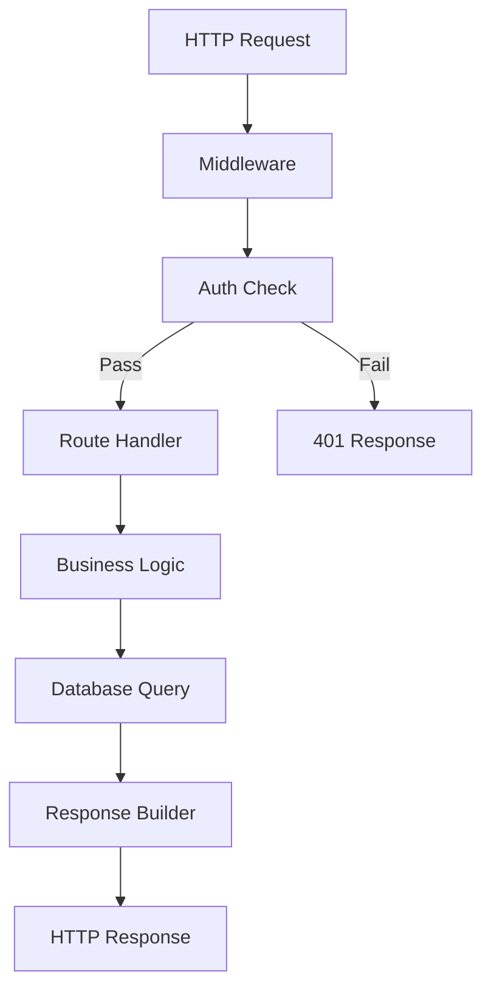
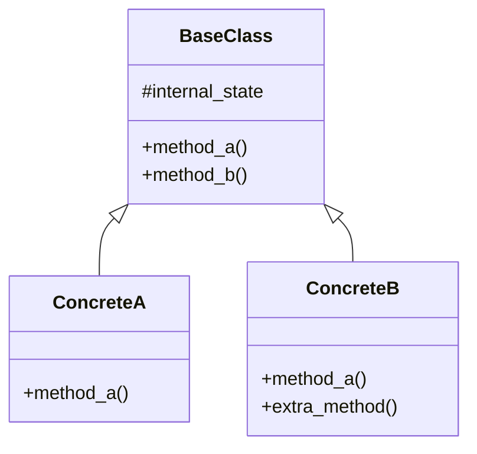
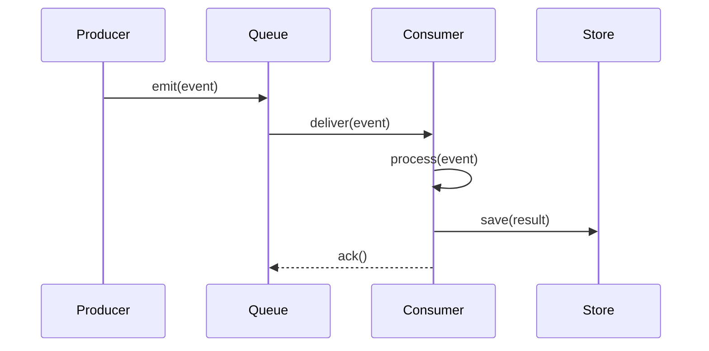
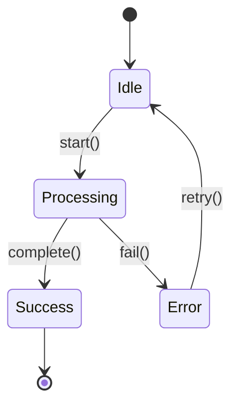
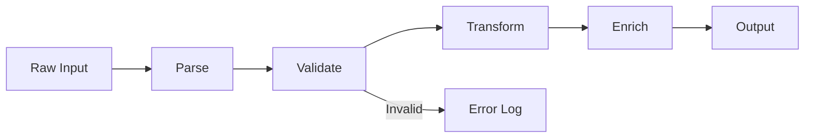
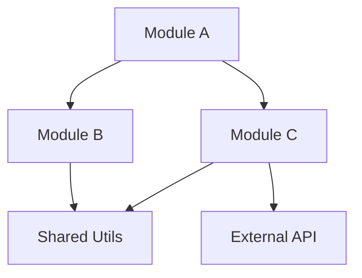
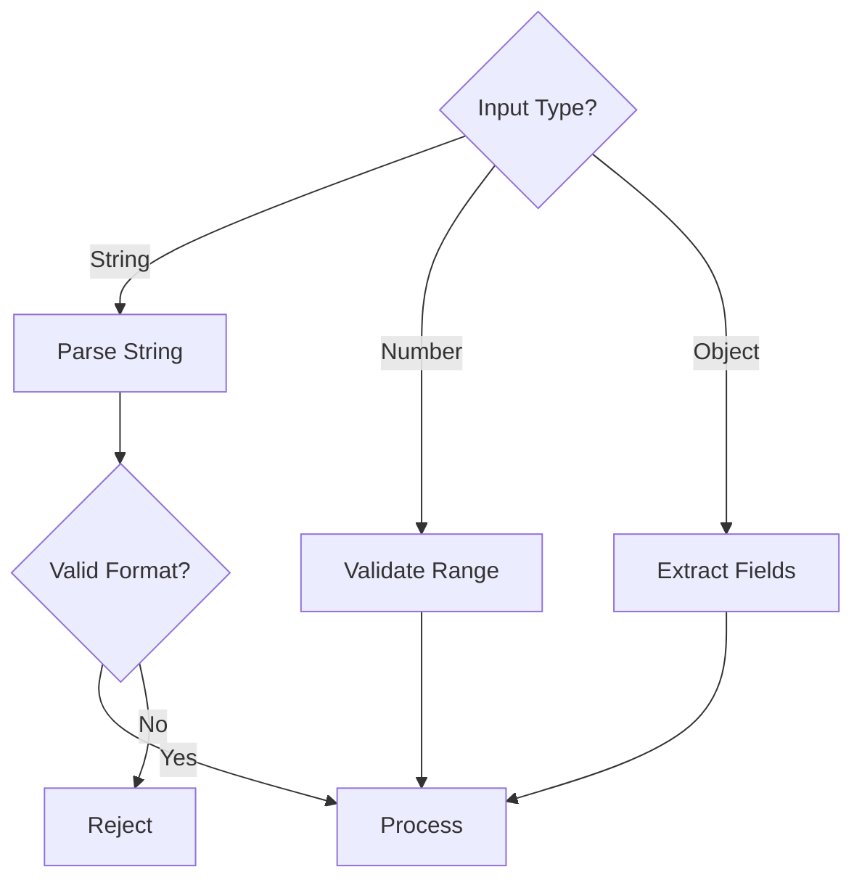

# Diagram Patterns Reference

Common Mermaid diagram patterns for code explanations.

## API Handler / Request Pipeline

## Class Hierarchy

## Event-Driven Flow

## State Machine

## Pipeline / Data Transformation

## Dependency Graph

## Decision Tree

## Choosing the Right Diagram

| Scenario | Diagram Type |
|----------|-------------|
| Function calls between components | sequenceDiagram |
| Decision logic, branching | flowchart TD |
| Data transformation pipeline | graph LR |
| Class/interface relationships | classDiagram |
| Object lifecycle states | stateDiagram-v2 |
| Module dependencies | graph TD |
| Concurrent/parallel flows | sequenceDiagram with par blocks |
